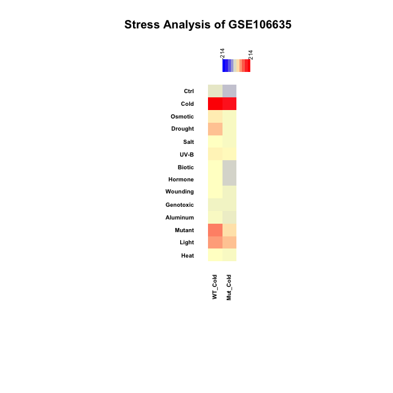

```{r setup, include = FALSE}
knitr::opts_chunk$set(
  collapse = TRUE,
  comment = "#>"
)
```

PhysioSpace is a robust statistical method for relating high dimensional omics data sets^[Lenz, Michael, et al. "PhysioSpace: relating gene expression experiments from heterogeneous sources using shared physiological processes." PLoS One 8.10 (2013): e77627]. It is designed to take advantage of the vast availability of public omics data, which in combination with statistical approaches makes a potent tool capable of analyzing heterogeneous biological data sets.

PhysioSpaceMethods is a R package which provides an implementation of PhysioSpace method alongside other handy functions for making PhysioSpace an easily accessible tool for R users.


#### Table of Contents
**[Installation Instructions](#installation-instructions)**<br>
**[Usage Instructions](#usage-instructions)**<br>

### Installation Instructions
#### Installing via Devtools (Recommended method):
Easiest way to install PhysioSpaceMethods is via <a href="https://cran.r-project.org/web/packages/devtools/">devtools</a> package.
After installing devtools from cran, you can install PhysioSpaceMethods by:
```r
devtools::install_github(repo = "JRC-COMBINE/PhysioSpaceMethods", build_vignettes = TRUE)
```

#### Alternative installation methods (Manual download):
In case you encountered any problem while installing PhysioSpaceMethods, you can download the repository directly and 
install the package from downloaded local files.
In your terminal, first clone the repository in your desired repository:
```Shell
cd [Your desired directory]
git clone https://github.com/JRC-COMBINE/PhysioSpaceMethods.git
```
Then install the downloaded package using <a href="https://cran.r-project.org/web/packages/devtools/">Devtools</a>:
```Shell
R -e "devtools::install_local('./PhysioSpaceMethods/', build_vignettes = TRUE)"
```

### Usage Instructions
PhysioSpaceMethods can map user samples inside a physiological space, calculated beforehand from a compendium of known samples. Few examples are provided here to demonstrate how to use this package.

#### Example One: E-MTAB-2836 Analysis
With the first example We will show how PhysioSpace can relate RNA-seq data to data generated with micro-array.
The data set used in this example is <a href="https://www.ebi.ac.uk/gxa/experiments/E-MTAB-2836/">
E-MTAB-2836</a>, a RNA-seq atlas of coding RNA from tissue samples of 122 _**human**_ individuals representing 32 
different tissues, stored on ebi's <a href="https://www.ebi.ac.uk/gxa/home">
Expression Atlas</a>.

To start the analysis, first we prepare the E-MTAB-2836 for our pipeline. You can download the data set manually from 
<a href="https://www.ebi.ac.uk/gxa/experiments/E-MTAB-2836/Downloads">this page (the 'Summary of the expression results for this experiment ready to view in R' link)</a>, or use the following command in R:
```r
#Download:
download.file(url = "https://www.ebi.ac.uk/gxa/experiments-content/E-MTAB-2836/static/E-MTAB-2836-atlasExperimentSummary.Rdata",
              destfile= "E-MTAB-2836-atlasExperimentSummary.Rdata") # We're downloading into the working directory, obviously using any other directory is possible.
```

After downloading (and normalising if necessary), the data can be analysed using "calculatePhysioMap()" function. It is important to note that 'InputData' of the function calculatePhysioMap() has specific format requirements which need to be met for the function to perform properly. Detailed description of input requirements can be found in calculatePhysioMap's help page, but in short, 'InputData' has to be <sup>1-</sup> a matrix, with <sup>2-</sup> genes in rows, <sup>3-</sup> identified by Entrez IDs which are stored in 'rownames' of the matrix, and <sup>4-</sup> samples in columns, <sup>5-</sup> identified by sample names stored in 'colnames' of the matrix. Lastly, <sup>6-</sup> values of InputData matrix should be relative, e.g. fold changes of genes rather than pure gene expressions. In our example, we prepare the InputData by taking four steps listed as follows:

* **Converting gene expression data into a matrix:** PhysioSpaceMethods expects a matrix as input. In this example 
E-MTAB-2836-atlasExperimentSummary.Rdata contains a RangedSummarizedExperiment object, from which we have to extract a gene expression matrix:
```r
#Making the gene expression matrix:
library(SummarizedExperiment) #SummarizedExperiment is needed for working with RangedSummarizedExperiment objects.
load("E-MTAB-2836-atlasExperimentSummary.Rdata") #Loading the object into R
EMTAB2836CountMatrix <- assay(experimentSummary$rnaseq)
```

* **Having genes in rows and samples in columns, with Entrez IDs in rownames:** After converting our gene expression data 
to a matrix, we have to make sure that we have genes in rows and samples in columns, with genes identified by Entrez IDs stored in 'rownames' of the matrix. In our case we already have genes as rows and samples as columns in EMTAB2836CountMatrix. However Ensembl IDs are stored in rownames, which have to be converted to Entrez IDs. There are numerous ways for this conversion. For example by using the 
<a href="https://david.ncifcrf.gov/conversion.jsp">David's Gene ID Conversion Tool</a>, or by using 
Ensembl's <a href="https://www.ensembl.org/biomart/">BioMart</a> or <a href="https://bioconductor.org/packages/release/bioc/html/biomaRt.html">biomaRt's package</a> in R.
Here we used biomaRt's package:
```r
#Converting Ensembl to Entrez IDs:
library(biomaRt)
humaRt <- useMart(biomart = "ENSEMBL_MART_ENSEMBL", dataset = "hsapiens_gene_ensembl")
ConvTabelle <- getBM(attributes = c("ensembl_gene_id","entrezgene"),
                     filters = "ensembl_gene_id", values = rownames(EMTAB2836CountMatrix),
                     mart = humaRt)
rownames(EMTAB2836CountMatrix) <- ConvTabelle$entrezgene[match(rownames(EMTAB2836CountMatrix),
                                                       ConvTabelle$ensembl_gene_id)]
EMTAB2836CountMatrix <- EMTAB2836CountMatrix[!is.na(rownames(EMTAB2836CountMatrix)),] #We remove the IDs that couldn't be converted and turned into NAs.
```

* **Writing sample names in colnames:** this step is not necessary for proper calculation, but it is highly recommended as it helps in proper inference of the result matrix. Sample names should be short, and to the point. Since in this example we aim to 
match RNA-seq counts of different human tissues to their corresponding tissues in a micro-array compendium, we use the tissue 
names as colnames of EMTAB2836CountMatrix:
```r
#Assigning colnames:
colnames(EMTAB2836CountMatrix) <- colData(experimentSummary$rnaseq)$organism_part
```

* **Having _RELATIVE_ values for gene expression:** PhysioSpace method expects relative values as input, i.e. it assumes the most 
positive values correspond to up-regulated genes and most negative values correspond to down-regulated genes. Easiest way to 
calculate this relative value is by calculating fold change, although more proper statistical tests could result in better performance.
In this specific example we use fold change:
```r
#Calculating Fold-Changes:
EMTAB2836CountMatrixRelativ <- EMTAB2836CountMatrix - apply(EMTAB2836CountMatrix,1,mean)
```
We used the gene-wise mean value of the whole data set as a virtual control sample and calculated the fold changes based on this
virtual control, since all data points in E-MTAB-2836 are biopsy samples and there is no actual control samples. At the same time, because of the high number of samples in E-MTAB-2836, the mean value is a good measure of background noise on each gene. Therefore mean values work great as controls to compare against.
As mentioned above, there are more sophisticated ways for this calculation,
one example could be to use the signed p value of a statistical test in logarithm scale, (which will come later for the other example
in this vignette).


Having the proper format for the input, the main calculation can be done easily by using the function calculatePhysioMap.

calculatePhysioMap() has two required arguments: InputData, which is the relative gene expression matrix, and Space, which is the Physiological Space in which we want to map our input data. In this example we use [LUKK](https://www.ncbi.nlm.nih.gov/pmc/articles/PMC2974261/) space from [HumanPhysioSpace](https://github.com/JRC-COMBINE/HumanPhysioSpace):
```r
#Main calculation:
library(PhysioSpaceMethods)
library(HumanPhysioSpace) # you can install this package from https://github.com/JRC-COMBINE/HumanPhysioSpace
RESULTS <- calculatePhysioMap(InputData = EMTAB2836CountMatrixRelativ, Space = HS_LUKK_Space)
```
For more information about the available Spaces in HumanPhysioSpace package, detail explanation about
HS_LUKK_Space and information about other input options of calculatePhysioMap(), we recommend the reader to check the documentation
of this package and HumanPhysioSpace.

In cases with large number of input samples, we recommend running calculatePhysioMap() in parallel:
```r
#Main calculation in parallel:
RESULTS <- calculatePhysioMap(InputData = EMTAB2836CountMatrixRelativ, Space = HS_LUKK_Space, PARALLEL = T, NumbrOfCores = 4)
```

The output of calculatePhysioMap(), which here we called 'RESULTS', is a matrix with the same number of columns as the number of 
samples in 'InputData', and the same number of rows as the number of axes (Columns) in the 'Space'. The 
value in row M and Column N in RESULTS is the mapped values of N<sup>th</sup> sample on M<sup>th</sup> axis of the Space.

In our example there are 200 samples. We randomly choose 5 samples out of 200 and show the matching between RNA-seq input 
data set to micro-array reference compendium is successful:
```r
#Choosing 5 random samples:
set.seed(seed = 0) #So results would be reproducable 
RESULTS5Random <- RESULTS[,sample(x = 1:ncol(RESULTS), size = 5)]
#Plotting the results:
PhysioHeatmap(PhysioResults = RESULTS5Random, main = "RNA-seq vs Microarray", SymmetricColoring = T, SpaceClustering = T, Space = HS_LUKK_Space, ReducedPlotting = 5)
```


As shown in Fig 1, we expect to have the highest values (most red) in the intersection of
each column with its corresponding tissue in rows. From the 5 samples we analysed, "skeletal muscle tissue", "esophagus" and "placenta" 
are clearly matched to their corresponding tissues from micro-array space. From two remaining samples, "vermiform appendix" is matched to blood,
and that is because there is no appendix tissue sample in Lukk data set. Considering that, matching to blood makes sense because the vermiform appendix 
biopsy is very likely to contain a large portion of blood, hence the conversion from RNA-seq to micro-array is successful in this sample
as well. Same is true for the sample "smooth muscle tissue": there are many organs from which this smooth muscle sample could be acquired, and since no more extra information is provided in E-MTAB-2836 about this sample except that the sample is smooth muscle tissue from a female adult human, based on our results it is highly probable that the smooth muscle sample is acquired from uterus.

#### Example Two: GSE106635
To show the application of PhysioSpace in plant stress analysis, we will analyse <a href="https://www.ncbi.nlm.nih.gov/geo/query/acc.cgi?acc=GSE106635">
GSE106635</a> from NCBI's <a href="https://www.ncbi.nlm.nih.gov/geo/">
Gene Expression Omnibus or GEO</a> as our second example.

There are numerous ways to acquire a data set from GEO, for example by using <a href="https://bioconductor.org/packages/release/bioc/html/GEOquery.html">GEOquery</a>. Here we directly download 
the CEL files and normalise them with <a href="https://www.bioconductor.org/packages/release/bioc/html/affy.html">affy</a> package:
```r
#Download and untar:
download.file(url = "https://www.ncbi.nlm.nih.gov/geo/download/?acc=GSE106635&format=file",
              destfile= "GSE106635_RAW.tar") # We're downloading into the working directory, obviously using any other directory is possible.
untar(tarfile = "GSE106635_RAW.tar", exdir = "GSE106635_RAW")

#Normalising:
library(affy)
GSE106635ESet <-
  justRMA(
    filenames = list.files(path = "GSE106635_RAW", full.names = T)
  )
```

After downloading and normalising, we need to prepare the data before using it as InputData of calculatePhysioMap function. 
Unlike the last example, in this one we use signed p values:

* Convert gene expression data into a matrix of signed p values: we calculate the signed p value of Student's t-test using the 
<a href="https://bioconductor.org/packages/release/bioc/html/limma.html">limma</a> package.
```r
#Converting expression set to matrix:
GSE106635ESetExp <- exprs(GSE106635ESet)
#Modelling and statistical testing:
library(limma)
DESIGN <- model.matrix(object = ~0+annot, data = data.frame(annot=c(rep("WT_Ctrl",2),rep("Mut_Ctrl",2),
                                                                    rep("WT_Cold",2),rep("Mut_Cold",2))))
FITMain <- lmFit(GSE106635ESetExp, DESIGN)
cont.matrix <- makeContrasts(contrasts = c("annotWT_Cold-annotWT_Ctrl","annotMut_Cold-annotMut_Ctrl"), levels=DESIGN)
FITCont <- contrasts.fit(FITMain, cont.matrix)
FITCont <- eBayes(FITCont)
WTResults <- topTable(fit = FITCont, coef = "annotWT_Cold-annotWT_Ctrl", adjust.method="BH", number = Inf, sort.by = "none")
MutResults <- topTable(fit = FITCont, coef = "annotMut_Cold-annotMut_Ctrl", adjust.method="BH", number = Inf, sort.by = "none")
GSE106635SignedPValues <- cbind(-log2(WTResults$adj.P.Val)*sign(WTResults$logFC),-log2(MutResults$adj.P.Val)*sign(MutResults$logFC))
rownames(GSE106635SignedPValues) <- rownames(GSE106635ESetExp)
```

* Have genes in rows and samples in columns, with Entrez IDs in rownames: For converting the Affymetrix ATH1 probe IDs to Entrez IDs
we use <a href="https://bioconductor.org/packages/release/bioc/html/biomaRt.html">biomaRt's package</a>:
```r
#Converting AffyID to EntrezID:
library(biomaRt)
planaRt <- useMart(biomart = "plants_mart", host = "plants.ensembl.org", dataset = "athaliana_eg_gene")
ConvTabelle <- getBM(attributes = c("affy_ath1_121501","entrezgene"),
                     filters = "affy_ath1_121501", values = rownames(GSE106635SignedPValues),
                     mart = planaRt)
rownames(GSE106635SignedPValues) <- ConvTabelle$entrezgene[match(rownames(GSE106635SignedPValues),ConvTabelle$affy_ath1_121501)]
GSE106635SignedPValues <- GSE106635SignedPValues[!is.na(rownames(GSE106635SignedPValues)),]
```

* Have **RELATIVE** values for gene expression: in this example: Since we calculated signed p values, numbers in GSE106635SignedPValues are already relative.

* Writing sample names in colnames: In GSE106635SignedPValues, first column corresponds to wild type Col-0 response to cold stress, and second column to TabZIP6-overexpressed Arabidopsis line (L20) response to cold stress. We will name samples as follows:
```r
#Writing names into colnames:
colnames(GSE106635SignedPValues) <- c("WT_Cold","Mut_Cold")
```

Now that we prepared the input, the main calculation can be done by using the function calculatePhysioMap():
```r
#Main calculation:
library(PhysioSpaceMethods)
library(PlantPhysioSpace)
RESULTS <- calculatePhysioMap(InputData = GSE106635SignedPValues, Space = AT_Stress_Space)
```
Note that as mentioned in the last example, calculatePhysioMap() has to have at least two inputs: 'InputData' which in this case is the signed p value matrix, and 'Space' which is the Physiology Space in which we want the InputData to be mapped. In this example we used AT_Stress_Space from PlantPhysioSpace package. For more information about the available plant Spaces and detailed explanation about
AT_Stress_Space, we recommend the reader to check the documentation of the PlantPhysioSpace package.

All samples in GSE106635 are under cold stress condition, so we expect to see high values (similarities) on the 'Cold' dimension of 
the AT_Stress_Space:
```r
#Plotting the results:
PhysioHeatmap(PhysioResults = RESULTS, main = "Stress Analysis of GSE106635", SymmetricColoring = T, SpaceClustering = T, Space = AT_Stress_Space, PlotSize = 21)
```


As shown Fig. 2, samples of GSE106635 are detected as plants under cold stress.


