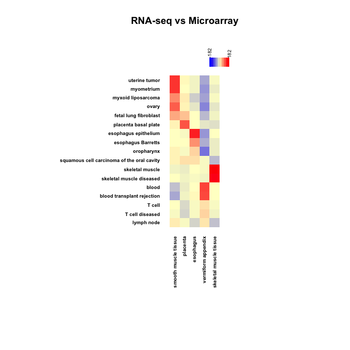

```{r setup, include = FALSE}
knitr::opts_chunk$set(
  collapse = TRUE,
  comment = "#>"
)
```

PhysioSpace is a robust statistical method for relating high dimensional omics data, published in Lenz et. al.^[Lenz, Michael, et al. "PhysioSpace: relating gene expression experiments from heterogeneous sources using shared physiological processes." PLoS One 8.10 (2013): e77627]. It is designed to take advantage of the vast availability of public omics data, which in combination with statistical approaches make a potent tool capable of analyzing heterogenious biological data sets.

PhysioSpaceMethods is a R package which provides an implementation of PhysioSpace method alongside other handy functions for making PhysioSpace an easy accessible tool for R users.


#### Table of Contents
**[Installation Instructions](#installation-instructions)**<br>
**[Usage Instructions](#usage-instructions)**<br>

### Installation Instructions
#### Installing via Devtools (Recommended method):
Easiest way to install PhysioSpaceMethods is via <a href="https://cran.r-project.org/web/packages/devtools/">Devtools</a>.
After installing Devtools from cran, you can install PhysioSpaceMethods by:
```r
devtools::install_github(repo = "JRC-COMBINE/PhysioSpaceMethods", build_vignettes = TRUE)
```

#### Alternative installation methods (Manual download):
In case you encountered any problem while installing PhysioSpaceMethods, you can download the repository first and 
install the package from downloaded local files.
In your terminal, first clone the repository in your desired repository:
```Shell
cd [Your desired directory]
git clone https://github.com/JRC-COMBINE/PhysioSpaceMethods.git
```
Then install the downloaded package using <a href="https://cran.r-project.org/web/packages/devtools/">Devtools</a>:
```Shell
R -e "devtools::install_local('./PhysioSpaceMethods/', build_vignettes = TRUE)"
```

### Usage Instructions
PhysioSpaceMethods can map user samples inside a physiological space, calculated prior from a compendium of known samples. Here we demonstrate 
the power of the method with few examples.

#### Example One: E-MTAB-2836 Analysis
With the first example We will show how PhysioSpace can relate RNA-seq data to data generated with microarray.
The data set we will use in our first example analyse is <a href="https://www.ebi.ac.uk/gxa/experiments/E-MTAB-2836/">
E-MTAB-2836</a>, a RNA-seq atlas of coding RNA from tissue samples of 122 _**human**_ individuals representing 32 
different tissues, stored on ebi's <a href="https://www.ebi.ac.uk/gxa/home">
Expression Atlas</a>.

To start the analysis, first we prepare the E-MTAB-2836 for our pipeline. You can download the data set manually from 
<a href="https://www.ebi.ac.uk/gxa/experiments/E-MTAB-2836/Downloads">this page (the 'Summary of the expression results for this experiment ready 
to view in R' link)</a>, or use the following command in R:
```r
#Download:
download.file(url = "https://www.ebi.ac.uk/gxa/experiments-content/E-MTAB-2836/static/E-MTAB-2836-atlasExperimentSummary.Rdata",
              destfile= "E-MTAB-2836-atlasExperimentSummary.Rdata") # We're downloading into the working directory, obviously using any other directory is possible.
```

After downloading the data (and normalising if necessary), we need to take four important steps before using the data as
input in PhysioSpaceMethods.

* **Convert gene expression data into a matrix:** PhysioSpaceMethods expects a matrix as input. Right now 
E-MTAB-2836-atlasExperimentSummary.Rdata contains a RangedSummarizedExperiment object, from which we have to extract a gene expression matrix:
```r
#Making the gene expression matrix:
library(SummarizedExperiment) #SummarizedExperiment is needed for working with RangedSummarizedExperiment objects.
load("./TRAsh/E-MTAB-2836-atlasExperimentSummary.Rdata") #Loading the object into R
EMTAB2836CountMatrix <- assay(experimentSummary$rnaseq)
```

* **Have genes in rows and samples in columns, with Entrez IDs in rownames:** After converting our gene expression data 
into a matrix, we have to make sure we have genes in rows and samples in columns, which in our case we already have 
in EMTAB2836CountMatrix But in rownames of the matrix, there are Ensembl IDs, which we 
have to convert to Entrez IDs. There are numerous ways for this conversion, for example using the 
<a href="https://david.ncifcrf.gov/conversion.jsp">David's Gene ID Conversion Tool</a>, or using 
Ensembl's <a href="https://www.ensembl.org/biomart/">BioMart</a> or <a href="https://bioconductor.org/packages/release/bioc/html/biomaRt.html">biomaRt's package</a> in R.
Here we used biomaRt's package:
```r
#Converting Ensembl to Entrez IDs:
library(biomaRt)
humaRt <- useMart(biomart = "ENSEMBL_MART_ENSEMBL", dataset = "hsapiens_gene_ensembl")
ConvTabelle <- getBM(attributes = c("ensembl_gene_id","entrezgene"),
                     filters = "ensembl_gene_id", values = rownames(EMTAB2836CountMatrix),
                     mart = humaRt)
rownames(EMTAB2836CountMatrix) <- ConvTabelle$entrezgene[match(rownames(EMTAB2836CountMatrix),
                                                       ConvTabelle$ensembl_gene_id)]
EMTAB2836CountMatrix <- EMTAB2836CountMatrix[!is.na(rownames(EMTAB2836CountMatrix)),] #We remove the IDs that couldn't be converted and turned into NAs.
```

* **Writing sample names in colnames:** this step is not necessary for proper calculation, but will help in proper inference of
the result matrix, so it is highly recommended. Sample names should be short, and to the point. Since in this example we aim to 
match RNA-seq counts of different human tissues to their corrisponding tissues in a microarray compendium, we use the tissue 
names as colnames of EMTAB2836CountMatrix:
```r
#Assigning colnames:
colnames(EMTAB2836CountMatrix) <- colData(experimentSummary$rnaseq)$organism_part
```

* **Have _RELATIVE_ values for gene expression:** PhysioSpace method expects relative values as input, i.e. it assumes the most 
postive values correspond to up-regulated genes and most negative values correspond to down-regulated genes. Easiest way to 
calculate this relative value is by calculating fold change, although more proper statistical tests could result in better performance.
In this specific example we use fold change:
```r
#Calculating Fold-Changes:
EMTAB2836CountMatrixRelativ <- EMTAB2836CountMatrix - apply(EMTAB2836CountMatrix,1,mean)
```
We used the gene-wise mean value of the whole data set as a virtual control sample and calculated the fold changes based on this
virtual control, since E-MTAB-2836 contains biopsy samples only and there is no actual control samples. At the same time, because of high
number of samples in E-MTAB-2836, the mean value is a good measure of background noise on each gene so mean values work great as controls
to compare against.
As mentioned above, there are more sophisticated ways for this calculation,
for example by using the signed p value of a statistical test in logarithm scale, (which will come later for other examples
in this vignette).


Now that we prepared the proper input for PhysioSpaceMethods, the main calculation can be done easily by using the function
"calculatePhysioMap()".

calculatePhysioMap has two required arguments: InputData, which is the relative gene expression matrix we prepared, and Space, which is 
the Physiological Space in which we want to map our input data. In this example we use 
[LUKK](https://www.ncbi.nlm.nih.gov/pmc/articles/PMC2974261/) space from [HumanPhysioSpace](https://github.com/JRC-COMBINE/HumanPhysioSpace):
```r
#Main calculation:
library(PhysioSpaceMethods)
library(HumanPhysioSpace) # you can install this package from https://github.com/JRC-COMBINE/HumanPhysioSpace
RESULTS <- calculatePhysioMap(InputData = EMTAB2836CountMatrixRelativ, Space = HS_LUKK_Space)
```
For more information about the available Spaces in HumanPhysioSpace package, detail explanation about
HS_LUKK_Space and information about other input options of calculatePhysioMap() we recommend the reader to check the documentation
of this package and HumanPhysioSpace.

In cases with large number of samples, we recommend running calculatePhysioMap() in parallel:
```r
#Main calculation in parallel:
RESULTS <- calculatePhysioMap(InputData = EMTAB2836CountMatrixRelativ, Space = HS_LUKK_Space, PARALLEL = T, NumbrOfCores = 4)
```

The output of calculatePhysioMap(), which here we called 'RESULTS', is a matrix with the same number of columns as the number of 
samples (Columns) we had in 'InputData', and the same number of rows as the number of axes (Columns) we had in the 'Space'. The 
value in row M and Column N in RESULTS is the mapped values of Nth sample on Mth axis of the Space.

In our example there were 200 samples, here we randomly choose 5 samples out of 200 and show the matching between RNA-seq input 
data set to microarray reference compendium is successful:
```r
#Choosing 5 random samples:
set.seed(seed = 0) #So results would be reproducable 
RESULTS5Random <- RESULTS[,sample(x = 1:ncol(RESULTS), size = 5)]
#Plotting the results:
PhysioHeatmap(PhysioResults = RESULTS5Random, main = "RNA-seq vs Microarray", SymmetricColoring = T, SpaceClustering = T, Space = HS_LUKK_Space, ReducedPlotting = 5)
```


Based on Fig 1, we will go through samples we analysed; We expect to have the highest values (most red) in the intersection of
each column with its corrisponding tissue in rows. From the 5 samples we analysed, "skeletal muscle tissue", "esophagus" and "placenta" 
are clearly matched to their corrisponding tissues from microarray space. From remaining two samples, "vermiform appendix" matched to blood,
since there is no appendix tissue sample in Lukk data set. Considering that, matching to blood makes sense because the vermiform appendix 
biopsy is very likely to have a large portion of blood in it, hence the conversion from RNA-seq to microarray is successful in this sample
as well. Same is true for the sample "smooth muscle tissue": there are many organs from which this smooth muscle sample could be acquired, and since no more extra information is provided in E-MTAB-2836 about this sample except that the sample is smooth muscle tissue from a female adult human, based on our results it is highly probable that the smooth muscle sample is acquired from uterus.

#### Example Two: GSE106635

#### Example Three: GSE93420

